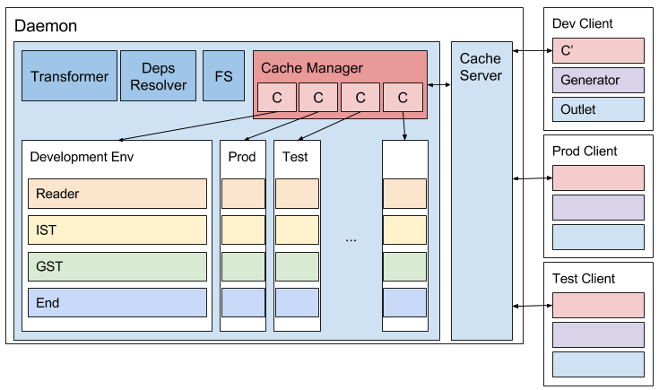

# Mendel v2 developer documentation
In this version, Mendel became a build system instead of being a plugin to a bundler that happened to build. The highlights are:
- Variation or A/B testing is a first class citizen
- Utilize multiple cores for speed
- Pluggable: transformer, dependency graph mutator (generator), and build output

## Introduction


Mendelv2 introduces new architecture that optimizes in preventing redundant operations and leverages parallelism of independent tasks. Moreover, in the new architecture, we ensure there is no chain reaction when a file changes which can happen to, often, Grunt-based system where filesystem is a mode of integrating different build systems.

The largest benefit of the new architecture comes from the daemon/client design. Because large portion of transformations can be reused for different outputs, the daemon contains bank of caches where files after heavy transformations are stored. Clients, then, can choose any bundling strategy or even opt to execute out of replica of an instance of a cache.

In this document, we will take bottom-up approach where we discuss building blocks first then tie them together later.

## Building blocks

### Entry
An entry is a primary unit of Mendel that maps 1-to-1 to every file in a source directory. It contains information like source, file path, dependencies, and other metadata. An entry only holds a single version of a source and its dependencies, which creates interesting restrictions.

Depending on which bundle requires an entry, an entry may need different set of transforms done which can yield wildly different source (imagine minification that also removes `require` statements). However, it was found from Mendel v1 that configuration varying bundles are mostly needed for different environment/context which will be further discussed in the __Environment__ section below.

### Type
A type is an abstraction on top of entry and an entry always belongs to a type based on user’s configuration. A type of entry determines which transforms will be done, how a type will translate to another type, and how an entry will be outputted at the end.

### Environment
Environment, or more specifically `MENDEL_ENV`, is the most important environment variable for users of Mendel. The invariable configuration restriction for entry transformations can be cumbersome. For a JavaScript entry, one may want to instrument for testing and minify or remove development-related code for production. In order to support such use case, entry needs to either store different versions of transformed source, which may widely differ by transform applied (order of same set of transforms also impacts how code generates), or have to create different entries when transforms differ. Mendel chose the latter approach and implemented it by having storage for entries (called "cache") *per environment*.

Using environment, you can change:
- transform configuration
- outlet configuration
- TODO; there are others.


### Pipeline
Most bundlers have variants of pipeline (needs citation).

Mendel's pipeline operates in largely two modes: per-entry and all-entries.

All files found in source directory are added to the pipeline. Without concerning others, each file creates an entry, populates metadata, and transforms according to their respective types. Along each step of the pipeline, when source is altered, dependencies of an entry are detected. When a dependency outside of the source directory is found, the new dependency is added to the pipeline dynamically and continues recursively. It is important to note that an entry _cannot step backwards_ in the pipeline but it _can add more entries to the pipeline_.

When a pipeline step starts to concern graph of dependencies, it must wait for all entries to be ready with all the respective transformations done (this is important as a transformation can add/remove dependencies and mutate the dependency graph). From this point on, all entries are considered as a unit and move together in the pipeline.


## Pipeline Steps
FileReader<sup>\*</sup> → IST<sup>\*</sup>  → GST<sup>\*</sup> → Generator → Outlet
(\* denotes steps that does dependency resolver at the end)

### Independent Source Transform
An Independent Source Transform (IST) is a transform that does not take any other source into account when transforming, and most source transforms fall into this category. For instance, when transforming ES2016 source code into ES5 compatible code, it is simply done by parsing the Abstract Syntax Tree (AST) and doing transformation on the tree; the most popular tool at the moment is [babel-preset-es2016](https://babeljs.io/docs/plugins/preset-es2016/). Do note that IST does not have to be confined to [babel](https://babeljs.io/) or, as a matter of fact, JavaScript.

A special type of IST is a parser. Parser is a source transform that mutates an entry's type from one to another. For example, SASS compiler transforms a SASS type to a CSS type. When parser exists for a type, IST first transforms from an originating type, then parses, and, finally, transforms for a destination type.

### Graph Source Transform

```
transformedEntrySource = IST(entry);
[transformedEntrySource, virtualEntry] = GST(entry, dep_1, dep_2, dep_1_1, ...);
```

Graph Source Transform (GST) differs from IST in its input: it not only takes an entry, but also its dependencies. Without concerning variations, conceptually, this is trivial. However, complexity increases rapidly when multiple variations exist in its dependencies and their sub-dependencies. Since a different set of dependencies and sub-dependencies can result in different source, GST has to explore multiple combinations of variations (combination because the order of variation dictates the order of variational resolution). Moreover, those combinational transform results have to be stored for correct resolution, which will be discussed more in depth later.

As of January of 2017, to avoid complexity, GST does not concern with all combination of variations but only a combination of a variation and a base variation.

### Generators
Generator is a step that understands the concept of bundle (output) and graph of dependencies. To describe this in more jovial words, let's imagine being in a grocery store. Every entry transformation up-to this step is now up for grab in shelves, and bundles are shopping carts. It is the job of the generators to walk the dependency graph (with a helper method) and collect entries from the shelves. However, unlike grocery shopping in real life, hopefully, generators are allowed to peek into others' shopping cart and claim entries as his/hers! It is possible to do interesting operations when this is allowed.

For example, `mendel-generator-node-modules` peeks into other bundles, and grabs every entry that is an npm package and is part of the application, and creates a separate bundle. This technique is favorable since, unless dependencies change often, the node_modules bundle is highly cacheable.

## Putting things together
### Daemon
As mentioned in earlier section, in a given environment or a given context, it is unlikely that one wants different set of transformations operated on an entry. The assumption allows entry to be highly reusable that Mendel has created a common cache multiple bundles can use.

Mendel Daemon is process that performs such highly reusable operations and holds caches (caches are where entries are stored) for all environments. More specifically, Daemon process watches file systems, reads, transforms (IST and GST), and resolves dependencies.

One important aspect of Mendel daemon is its pipeline. Unlike other pipeline implementations, Mendel’s pipeline allows entries to move independent of other entries unidirectionally -- when an entry is created, it goes through reader, IST, and GST in order. An entry, while moving through the pipeline, can add other entries in its dependency graph and those entries will start from the beginning.

Although daemon greatly benefits from the independence, it cannot be leveraged when operation involves dependency graphs of entries. As a result, starting from Graph source transform (GST), Mendel expects necessary transformations to have been done to all entries. It is true that GSTs are generally done on subset of entries and Mendel requires sub-depgraph to have been done, a GST can mutate dependency which impacts next GSTs that Mendel willfully avoided such implementation.


### Client
Mendel Client runs in separate process and is used when one tries to accomplish a task based on transformed entries. Few examples of the tasks are generation of JavaScript bundle or executing test. Based on environment variable and context, a client connects to daemon process using socket (can be replaced with WebSocket; Mendel is network agnostic) and syncs with a cache. Upon sync, a client performs generator and outlet which generates bundles (or grouping of entries) and outputs the bundles, respectively.


## Advanced Topic
### normalizedId

##### Simple case
```js
require('./foo/bar');
// resolves to
// related, `node-resolve`: https://github.com/substack/node-resolve
// related, `browser-resolve`: https://github.com/defunctzombie/node-browser-resolve
'./foo/bar/index.js'
'./foo/bar/index.es6'
'./foo/bar.js'
'./foo/bar/randomDir/randomMain.js' // in case of package.json's `main` property
'./foo/bar/randomDir/randomBrowser.js' // in case of package.json's `browser` property
```
##### Variational case
```js
require('./foo/bar');
// resolves to
'./src/baseVarDir/foo/bar/index.js'
'./src/baseVarDir/foo/bar.js'
'./src/baseVarDir/foo/bar/randomDir/randomMain.js'
'./src/baseVarDir/foo/bar/randomDir/randomBrowser.js'
'./src/varDirs/var1/foo/bar/index.js'
'./src/varDirs/var1/foo/bar.js'
'./src/varDirs/var1/foo/bar/randomDir/randomMain.js'
'./src/varDirs/var1/foo/bar/randomDir/randomBrowser.js'
```
Amongst these combinations, it is possible for source code to have below like directory structure:
```
src
├── baseVarDir
│   └── foo
│       └── bar
│           └── index.js
└── varDirs/var1 ("varDirs/var1" collapsed for visual ease)
    └── foo
        └── bar.js
```
For every variation, `require('./foo/bar')` will resolves to very different file which can cause cognitive overhead and very buggy code.

If you thought above was not too hard, below should be more complex:
```
src
├── baseVarDir
│   ├── dep.js
│   └── index.js
└── varDirs
    ├── var1
    │   └── index.js
    │   └── dep.js
    └── var2
        └── dep
            └── package.json
            └── moreDir/.../whatever.js
# index.js depends on dep.js
```
In single variational case, above is easy. Dependency resolving as follows:
- base: src/baseVarDir/index.js → src/baseVarDir/dep.js
- var1: src/varDirs/var1/index.js → src/varDirs/var1/dep.js
- var2: src/baseVarDir/index.js → src/varDirs/var2/dep/moreDir/.../whatever.js

However, if you imagine multivariate variation, it becomes:
- var2,var1: <font color=red>conflict</font> src/varDirs/var1/index.js → src/varDirs/var2/dep/moreDir/.../whatever.js

Above ambiguity is called a "conflict" as it is virtually impossible for variation developer to conceive or account for all combinations to be correct and safe.

A `normalizedId` is generated by stripping out extension, file name "index", and inspecting package.json pointers. The example folder structure will have following normalizedIds:

```
src
├── baseVarDir
│   ├── dep.js -> ./dep
│   └── index.js ->  ./
└── varDirs
    ├── var1
    │   └── index.js -> ./
    │   └── dep.js  -> ./dep
    └── var2
        └── dep
            └── package.json        
```

This allows Mendel to group entries that is possible to be `require`d by the same literal (this also imposes restriction to the file names in a codebase; more on this later) and it allows us to catch conflicts while resolving whose algorithm is depicted in pseudocode below.

```js
var entries = getEntriesByNormalizedId(normId);
assert(entries, [Entry_var1, Entry_var2]) // conflict
assert(entries, [Entry_var1]) // not a conflict
```

## Virtual Entries
TBD

# Package structure
## Core packages
- **mendel-resolver**: Although default resolve is wonderful, it lacks for two features -- it lacks “browser” property support which is covered by another package but also misses variational support. In variational world, how modules get resolved needs to look into variational directory
- **mendel-deps**: AST parse a source to detect ES6 import and CommonJS require and do variational resolve their path.

## Others
- **mendel-transform-babel**: IST for babel
- **mendel-transform-less**: IST for LESS
- **mendel-generator-node-modules**: Extracts node_modules from bundles and create separate node_modules bundle.
- **mendel-generator-extract**: Allows you to code split by declaring which paths need to be bundled separately away from designated bundle. The technique is widely known as code-splitting.
- **mendel-outlet-css**: Outputs CSS based on glob of entry ids defined in configuration

# Appendix
## Glossary
- Source: Any form of source including JS, CSS, binary file, images, and etc…
- Daemon: Long-running process that watches file-system and do computation intensive transformations
- Clients: Often, short lived process that consumes transformed entries to do something useful with them
- Independent Source Transform (IST): transforms that can be done without considering any other source
- Graph Source Transform (GST): transforms that must be done with other entries
- Generator: Bundle collection step. Grabs entries into a “basket”
- Outlet: Outputs a bundle created by a generator. I.e., mendel-outlet-browser-pack
- Runtime: Place where code will execute. Currently, node or browser. This concept is used in modules where, in package.json, one declares “main” and “browser” property.
